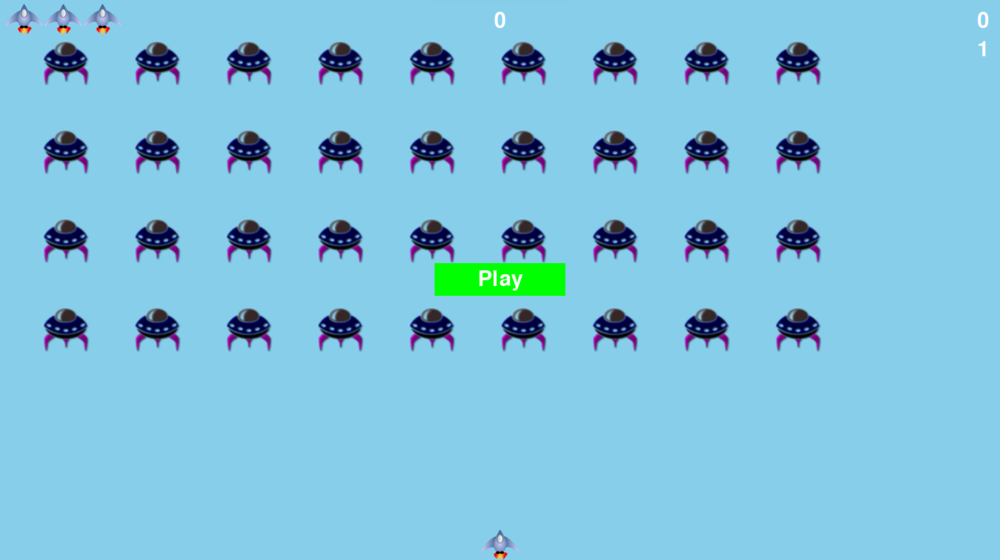

# Alien Invasion

## This is a game project based on the the legionary atari's game "Space Invaders"

We used pygame library, it is a collection of fun, powerful python's modules that 
manage graphics animations and even sound, making it easier for you to build
sophisticated games. With pygame library, handling tasks like drowing images to
the screen, ypu can focus on the higher-level logic of the game dynamics.

We create a rocket ship that move rigth and left and fires bullets in response to
player input, a fleet of aliens to destroy and adding a scoreboard.

## How to install:

Clone this repository in you Operating System

install python if you don´t have python: visit: https://www.python.org/downloads/ and choose your OS version.

install pygame with this command:  python -m pip install --user pygame

## How to start

After clone this repoistory, go to the alien_invasion folder and write in your console windows: <b>python .\alien_invasion.py</b>

If you are in linux ubuntu, only write in your console: <b>./alien_invasion.py</b>

## How to play
-> Right Arrow: to move the ship to the right
 
<- Left Arrow: to move the ship to the left
 
space bar: to fire bullets
 
Key q: to quit
 
Key p o click at the button PLAY:  to start the game

## Initial Screen

## Note: 

I hope you enjoy the game as much I enjoyed making it

## Authors:
### RobARC
